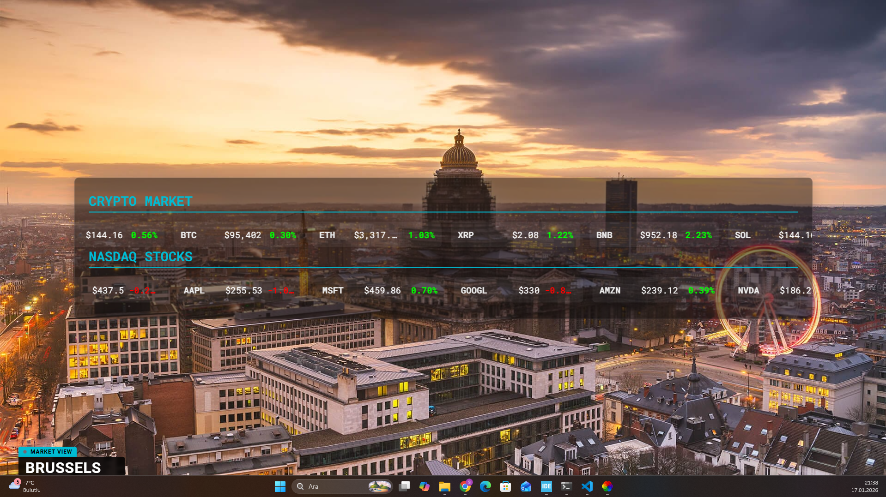

<div align="center">

  # 🏙️ Market Wall
  **Professional Financial Terminal Wallpaper for Lively**

  [](LICENSE)
  [](https://rocksdanister.github.io/lively/)
  [](releases)

  <p align="center">
    Turn your desktop into a live trading floor. Real-time Crypto, NASDAQ Stocks, and dynamic 4K cityscapes.
    <br />
    <br />
    <a href="https://github.com/yufurkan/Market-Wall_Wallpaper/releases/latest"><strong>📥 Download Latest Version</strong></a>
    ·
    <a href="https://github.com/yufurkan/Market-Wall_Wallpaper/issues">🐞 Report Bug</a>
  </p>

  
   
  

</div>

<br />

## ✨ Features

| Feature | Description |
| :--- | :--- |
| **🌍 Dynamic Atmosphere** | Automatically switches between **Morning** and **Night** 4K cityscapes. |
| **💎 Live Crypto Ticker** | Real-time tracking for Bitcoin, Ethereum, Solana, and more via **CoinGecko API**. (Plug & Play). |
| **📉 NASDAQ Stocks** | Track major tech stocks (Apple, Tesla, NVIDIA) using your own **Finnhub API key**. |
| **📺 Broadcast UI** | A clean, "Bloomberg-style" lower-third overlay showing live location and market status. |


---

## 🚀 Installation

### 1️⃣ Prerequisite
Download and install [Lively Wallpaper](https://rocksdanister.github.io/lively/) (Free & Open Source).

### 2️⃣ Import the Project
1. Go to the [**Releases**](https://github.com/yufurkan/Market-Wall_Wallpaper/releases) page.
2. Download the `Source code (zip)` of the latest version.
3. Unzip the folder.
4. Open the folder and drag **`index.html`** into the **Lively Wallpaper** window.
5. *Done! Crypto data works immediately.*

---

## 🔑 Stock API Setup 
*Crypto works out of the box. Follow these steps only if you want Stock Data (NASDAQ).*

1. Get a **FREE API Key** from [finnhub.io](https://finnhub.io/).
2. Navigate to the wallpaper installation folder (Right click in Lively -> Open File Location).
3. Find the file named `api_key.json`.
4. Open it with Notepad and paste your key:

<br>

```json
{
  "api_key": "YOUR_FINNHUB_KEY_HERE"
}
```
Note: Do not share your api_key.json file publicly. The system caches data to ensure you stay within free tier limits.

## ⚙️ Customization
You can tweak settings directly inside Lively Wallpaper's "Customize" menu:

Custom Symbols: Add extra stocks (e.g., AMD, INTC) or Cryptos (e.g., pepe, dogecoin).

Scroll Speed: Adjust how fast the tickers move.

Visibility: Toggle specific coins or stocks on/off.

## 🛠️ Tech Stack
Core: HTML5, CSS3 (Flexbox/Grid), JavaScript (ES6+).

APIs: CoinGecko (No Key), Finnhub (Key Required).

Storage: LocalStorage (for Caching).


<div align="center"> <sub>Created by <a href="https://github.com/yufurkan">Yusuf Furkan</a></sub> </div>